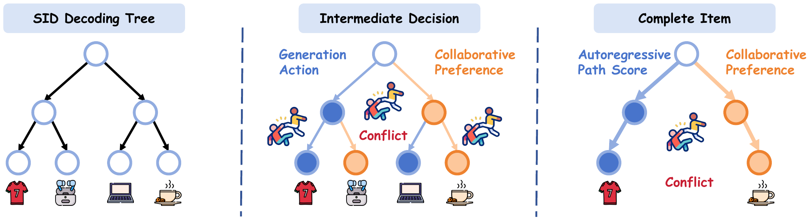

<p align="center"></p>

<h1 align="center">CoLaGR</h1>
<p align="center"><strong>Collaborative Latent Reasoning for Generative Recommendation</strong></p>
<p align="center">
  
  
  
</p>

<p align="center"><a href="#the-problem">The problem</a> | <a href="#one-command-reproduction">Reproduce</a> | <a href="#what-is-included">Files</a> | <a href="#acknowledgments">Credit</a></p>

## The problem

Semantic-ID generation makes a decision at each tree level, but an action label alone need not identify a user's collaborative preference. Even after a complete item is generated, its path score need not agree with collaborative evidence. CoLaGR addresses these two interfaces with **CoPref** (pre-action preference supervision) and **CoLeaf** (complete-item calibration).

<p align="center"></p>

<p align="center"></p>

## One-command reproduction

This release reproduces the **CoLaGR main-table row on all three domains**. It ships three validation-selected CoLaGR-G checkpoints (seed 2024), their matching Semantic-ID structures, and code for scored beam generation and validation-selected CoLeaf calibration. It does not package the four diagnostic RQs.

Prerequisites: Linux, a CUDA GPU, Python 3.12, and `aria2c`. Install a CUDA-compatible PyTorch build for your driver before installing this project. The benchmark is downloaded from its original publisher rather than redistributed here.

```bash
python -m venv .venv
source .venv/bin/activate
pip install -e .
bash scripts/reproduce.sh
```

The command downloads each official 5-core leave-one-out benchmark if needed, verifies its processed split and item mapping, exports **validation and test** candidates from each checkpoint with cumulative autoregressive log-probabilities, selects `alpha` independently on validation NDCG@10, and checks all four test metrics. It writes the paper-column-order summary to `results/main_table.csv`. Use `bash scripts/reproduce.sh musical` for one domain, `GPU=1` to select another GPU, or `BATCH_SIZE=128` for the paper's evaluation batch size when memory allows. The default batch size 32 changes only inference throughput. Generated data and logs remain in ignored `cache/` and `results/` directories.

| CoLaGR | R@5 | R@10 | N@5 | N@10 |
|:--|--:|--:|--:|--:|
| Musical Instruments | **0.0472** | **0.0694** | **0.0324** | **0.0395** |
| Industrial and Scientific | **0.0374** | **0.0536** | **0.0257** | **0.0309** |
| Video Games | **0.0740** | **0.1073** | **0.0510** | **0.0618** |

The Industrial, Musical, and Video test sets contain 50,985, 57,439, and 94,762 examples, respectively. CoLeaf uses a fixed 50-item beam, history length 10, and memory support 50. Validation selects `alpha=3.0`, `1.5`, and `3.0` for Industrial, Musical, and Video; calibration cannot alter candidate membership. `scripts/check_bundle.py` fails if any main metric differs by more than `5e-5`. The log-probability and candidate order are stored together in each generated beam record.

## What is included

| Path | Purpose |
|:--|:--|
| `release/{industrial,musical,video}/checkpoint.pth` | Three seed-2024 generator checkpoints |
| `release/{industrial,musical,video}/sid/` | Matching level token IDs and valid-prefix tries |
| `release/{industrial,musical,video}/processed_sid.sem_ids` | Matching collision-resolved Semantic IDs |
| `scripts/reproduce.sh` | One-command, three-domain main-row reproduction |
| `genrec/models/CoLaGR/` | Generator, pre-action states, and CoPref heads |
| `colagr/eval/` | Scored-beam export and CoLeaf evaluation |
| `colagr/copref/`, `colagr/teacher/` | Training-side preference construction |
| `assets/` | Problem illustration and architecture figure |

The processed Amazon benchmark contains user histories and product metadata, so it is **not** mirrored in this repository. It is obtained from the [original dataset provider](https://huggingface.co/datasets/McAuley-Lab/Amazon-Reviews-2023); the provided hashes guard against a silently changed split. The training-side code remains inspectable, but this artifact is scoped to reproducing the main results from released checkpoints, not retraining 150 epochs.

## Acknowledgments

The data pipeline and generator infrastructure adapt the open-source [Latte](https://github.com/hyp1231/Latte) code. We thank its authors for making their implementation available. Semantic-ID collision resolution follows the released PSID implementation. The original repositories are not embedded here; their provenance and license notice are retained in source and `LICENSE`.
