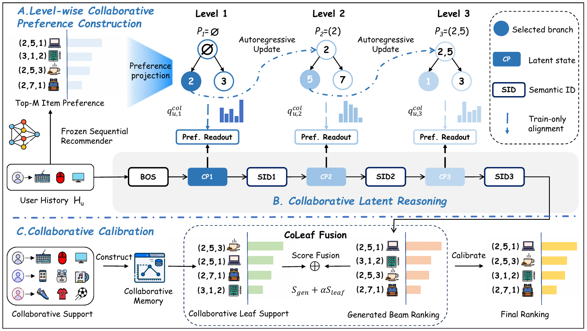

<p align="center"></p>

<h1 align="center">CoLaGR</h1>
<p align="center"><strong>Collaborative Latent Reasoning for Generative Recommendation</strong></p>
<p align="center"><a href="#quick-start">Quick start</a> · <a href="#reproduce-the-main-experiment">Main experiment</a> · <a href="#repository-map">Code map</a> · <a href="#acknowledgments">Acknowledgments</a></p>

<p align="center"></p>

CoLaGR turns a frozen sequential teacher's item-level preferences into level-wise supervision for a Semantic-ID generator. Its CoPref module guides latent decision states; CoLeaf calibrates the ranking of complete items on a fixed beam. This repository contains the **main experimental pipeline only**. It does not include datasets, pretrained weights, private experiment logs, or external project trees.

## Quick start

```bash
git clone <repository-url> CoLaGR
cd CoLaGR
python -m venv .venv
source .venv/bin/activate
pip install -e .
```

The examples below use the public Amazon Reviews 2023 benchmark. Download each 5-core domain with `bash scripts/download_amazon2023_benchmark_aria2.sh <domain>` or supply the same dataset through the Hugging Face loader. Install a PyTorch build compatible with your CUDA driver before training. Generated data and checkpoints stay under ignored local directories.

## Reproduce the main experiment

Each domain follows the same four stages: prepare Semantic IDs and teacher preferences, train CoLaGR-G, export a scored beam, and select/evaluate CoLeaf on validation/test. The teacher and generator must use the **same user/item mapping**. For an exact run, use the paper's 150-epoch, seed-2024 configuration and validation-selected preference weight.

```bash
export CATEGORY=Industrial_and_Scientific  # or Musical_Instruments / Video_Games
export LAMBDA_PREF=1.75                 # Musical: 1.0; Video Games: 0.75
export TEACHER_CHECKPOINT=/path/to/sasrec_teacher.pth

bash scripts/run_main.sh prepare
bash scripts/run_main.sh train
export GENERATOR_CHECKPOINT=/path/to/validated_colagr_checkpoint.pth
bash scripts/run_main.sh beam
bash scripts/run_main.sh coleaf
```

`prepare` exports the SID map, teacher top-M preferences, and Global CoPref tensors. To train the frozen SASRec teacher from scratch on the same mapping, first export its sequences and run the included trainer:

```bash
python colagr/teacher/export_latte_sasrec_data.py --category="$CATEGORY"
python colagr/teacher/llmsrec_sasrec/main.py --dataset="$CATEGORY" --device=0
```

The teacher checkpoint is saved below `colagr/teacher/llmsrec_sasrec/$CATEGORY/`. Set `TEACHER_CHECKPOINT` to that file before `prepare`. The generator writes a validation-selected `.pth` below `ckpt/`; set `GENERATOR_CHECKPOINT` to it before `beam`. `coleaf` selects the calibration weight using validation **only**, then evaluates test candidates without changing the beam. The scored candidate export uses cumulative autoregressive log-probabilities, not generator rank.

| Domain | CoPref weight used in the main run |
|:--|--:|
| Industrial & Scientific | 1.75 |
| Musical Instruments | 1.00 |
| Video Games | 0.75 |

The main scripts expose `DATASET`, `PYTHON`, `SEED`, `EPOCHS`, `GPU`, `TOP_M`, and `ALPHA_GRID` as environment variables. For the exact paper protocol and dataset split, see the manuscript and the arguments in `scripts/run_main.sh`. Run identifiers and artifact paths are deliberately local; no hosted checkpoint is required to inspect the implementation.

Run `python -m colagr.eval.protocol_checks` to check teacher/target separation and fixed evaluation behavior before launching a long training run.

## Repository map

| Path | Purpose |
|:--|:--|
| `genrec/models/CoLaGR/` | Generator, CoPref heads, SID tokenizer, configuration |
| `colagr/teacher/` | Frozen SASRec teacher and aligned preference export |
| `colagr/copref/` | SID artifact and Global CoPref construction |
| `colagr/eval/` | Scored-beam export and fixed-beam CoLeaf calibration |
| `scripts/run_main.sh` | Four-stage main experiment |
| `assets/architecture.png` | Architecture figure |

## Acknowledgments

We thank the authors of [Latte](https://github.com/hyp1231/Latte) for releasing their generative recommendation framework. CoLaGR builds on and adapts that framework's data pipeline and generator infrastructure. Semantic-ID construction also builds on the open-source collision-resolution implementation of PSID; its provenance is retained in the tokenizer comments. We do not redistribute either external project's repository as a subproject. The included `LICENSE` preserves the upstream license notice.
