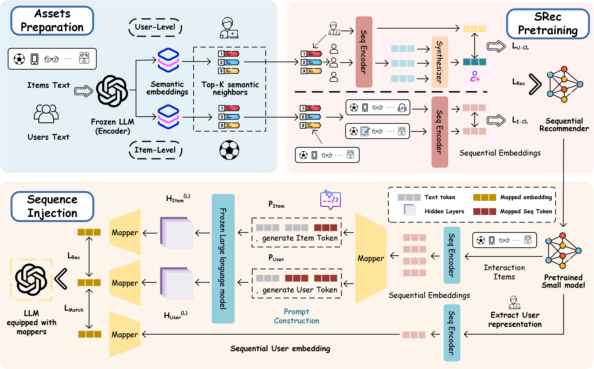

<div align="center">

<h1 style="font-size: 3.4em; margin-bottom: 0.15em;">EchoRec</h1>

<h2 style="font-size: 2.15em; margin-top: 0; margin-bottom: 0.25em;">Where Did Sequence Go?</h2>

<p style="font-size: 1.2em; max-width: 920px; line-height: 1.45; margin: 0 auto 1em auto;">
  <b>Robust Space Reshaping via Large-Small Model Collaboration for LLM-based Sequential Recommendation</b>
</p>

<p>
  
  
  
  
</p>

<p style="font-size: 1.05em; color: #666; max-width: 860px; line-height: 1.55; margin: 1em auto 1.4em auto;">
  EchoRec reshapes a compact sequential teacher with frozen LLM semantic references, then injects refined sequential structure into a frozen LLM for final ranking.
</p>



</div>

---

## Environment

```bash
conda create -n echorec python=3.13 -y
conda activate echorec
pip install -r requirements.txt
```

## Run

Set your local LLaMA-3B-compatible checkpoint and launch the one-click runner:

```bash
DATASET=CDs_and_Vinyl LLM_NAME=llama-3b LLM_PATH=/path/to/llama3_3b TRAIN_DEVICES=0,1 NPROC_PER_NODE=2 TEACHER_BACKBONE=bert4rec TEACHER_PREFIX=cds_bertstyle_nextitem_full SI_SAVE_DIR=cds_bert4rec_full_si_5090 python run_echorec.py
```

The runner uses the packaged benchmark data in `datasets/CDs_and_Vinyl/`, writes logs to `logs/`, and reports final validation/test SI metrics in the terminal.

## Data

```text
datasets/CDs_and_Vinyl/
```

## Note

This repository is prepared for anonymous review. Please use the anonymized repository link in submissions and discussions.
